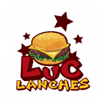

# Sistema Delivery - Delphi

Sistema desktop para gestão de delivery e atendimento automatizado pelo WhatsApp. O projeto centraliza cardápio, pedidos, adicionais, taxas de entrega, impressão e acompanhamento operacional em uma aplicação desenvolvida em Delphi com banco de dados MySQL.

## Principais recursos

- Atendimento automatizado e recepção de pedidos pelo WhatsApp com TInject.
- Cadastro de pizzas, bebidas, adicionais e imagens do cardápio.
- Controle de clientes, endereços, bairros e taxas de entrega.
- Acompanhamento de pedidos por status, da entrada à entrega.
- Impressão de cupons e relatórios com FastReport.
- Relatórios e gráficos de vendas por período e tipo de produto.
- Lista de bloqueio para contatos e rotinas de backup.
- Integração opcional com a API Distance Matrix do Google Maps.

## Estrutura

- `src`: código-fonte Delphi e recursos da aplicação.
- `src/BD/banco.sql`: estrutura e dados de demonstração do banco MySQL.
- `runtime/reports`: modelos de impressão utilizados pelo sistema.
- `runtime/db.example.db`: configuração local de exemplo, sem credenciais reais.
- `img`: imagens usadas nesta apresentação.

## Requisitos

O projeto foi configurado no Delphi 10.3 Rio e referencia componentes de terceiros, incluindo TInject/CEF4Delphi, FireDAC, FastReport, componentes TMS e DevExpress. Verifique `src/NextBotLanches.dproj` para a lista completa e use versões compatíveis com seu ambiente.

Também são necessários:

- MySQL ou MariaDB.
- Bibliotecas do cliente MySQL compatíveis com o FireDAC.
- Runtime do Chromium/CEF exigido pela versão do TInject utilizada.

## Configuração

1. Crie um banco MySQL e importe `src/BD/banco.sql`.
2. Compile o projeto `src/NextBotLanches.dproj` com as dependências instaladas.
3. Copie `runtime/db.example.db` para a pasta do executável e renomeie para `db.db`.
4. Copie os arquivos de `runtime/reports` e `runtime/som.wav` para a pasta do executável.
5. Abra a tela de configuração e informe host, banco, usuário, senha, porta e impressora.
6. Substitua `SUA_CHAVE_GOOGLE_MAPS` em `src/u_principal.pas` por uma chave própria, caso utilize o cálculo de distância.
7. Troque `ALTERE_ESTA_SENHA` por uma senha administrativa forte antes do uso.

## Segurança e distribuição

Este repositório não inclui banco local de produção, credenciais, chave real do Google Maps, executáveis, DLLs nem o pacote do Chromium/CEF. As dependências de terceiros devem ser obtidas em suas fontes oficiais e usadas conforme suas respectivas licenças.

## Recursos visuais

  
  
  

